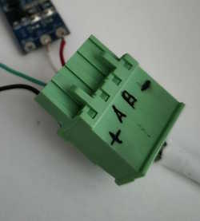

# nilan-cts600-homeassistant

This is a Home Assistant integration for the Nilan CTS600 HVAC control
system, controlling e.g. the [Nilan
VPL-15](https://www.en.nilan.dk/products/ventilation-with-cooling-heating/heat-pump-and-heat-pipe/vpl-15)
ventilation unit. The integration connects to the ventilation unit over
RS485/Modbus and **replaces the physical control panel**.


The integration implements the
[Climate](https://www.home-assistant.io/integrations/climate/)
interface for Home Assistant. This means that you can set the
ventilation unit's mode (auto, heat, cool, or off) and its target
temperature. You can also set the fan speed (1, 2, 3, or 4). Finally,
the thermometer in the physical control panel (Nilan sensor T15) is
replaced with any HA entity, typically a temperature sensor.  Also,
there are button entities corresponding to the physical buttons, and
separate sensor entities for the text display and various temperatures
and fan speed.

There are **two ways to connect**, described in this document:

| | **A. USB RS485 adapter** | **B. ESP32 WiFi bridge** |
|---|---|---|
| How | Adapter plugged into the HA machine | ESP32 running ESPHome as a Modbus TCP↔RTU bridge |
| Cabling | RS485 cable from the unit to the HA server | Only WiFi; the ESP32 sits at the unit |
| HA setting | `Modbus RTU (Serial)` | `Modbus TCP` |
| Extra hardware | USB-RS485 adapter | ESP32 + RS485 module (+ optional 12 V buck converter) |

---

## Contents

- [What is this integration for?](#what-is-this-integration-for)
- [Physical connection to the CTS600](#physical-connection-to-the-cts600)
- [Option A — USB RS485 adapter](#option-a--usb-rs485-adapter)
- [Option B — ESP32 WiFi bridge (Modbus TCP)](#option-b--esp32-wifi-bridge-modbus-tcp)
- [Installing the integration](#installing-the-integration)
- [Configuration](#configuration)
- [Operation](#operation)
- [Troubleshooting](#troubleshooting)
- [CTS600 technical information tidbits](#cts600-technical-information-tidbits)

---

## What is this integration for?

The Nilan VPL-15 ventilation unit (and similar units from Nilan) have
been delivered with a range of control systems over the years,
starting I believe with simple analog controls back in the day, until
todays modern CTS602 or CTS700-based control systems that support LAN
interfacing, mobile apps and whatnot.

This integration is specifically for units controlled via the CTS600
interface. Historically this is an intermediate technology, and
obsolete now since a number of years. The CTS600 is a digital system
and protocol, but not really designed to be interfaced or integrated
with other systems.

There exists a different integration in HACS for CTS602-based systems,
named [Nilan](https://github.com/veista/nilan).

This integration is created for my Nilan VPL-15 ventilation unit
controlled by CTS600. There are other Nilan ventilation units provided
with the CTS600 controller. These systems may or may not work as
is. If you have such a non-VPL-15 system, I'd be interested in making
this integration work, so please test and open an Github issue for
this purpose.

The following is a list of Nilan ventilation units other than the
VPL-15 that I believe have been delivered with the CTS600 controller:
  * Comfort-450
  * Comfort-600
  * Comfort-300
  * VPL-28
  * VP-18 M2
  * VGU-250

The Comfort-300 has reportedly also been tested.

---

## Physical connection to the CTS600

This applies to **both** connection options.

The Nilan VPL-15 (and presumably other) unit connects to the physical
control panel via **4 wires**. Two wires provide **12 V power**, and the
remaining two are the **RS485 A and B** communication wires.

Only the two A and B communication wires are used for communication.
**Do not connect the power wires to your RS485 adapter or module**, as this
will likely destroy it, and possibly also your PC and/or ventilation unit!
(The 12 V may only be used to *power* an ESP32 through a buck converter —
see [Powering the ESP32 from the 12 V bus](#3-powering-the-esp32-from-the-nilan-12-v-optional).)

The image below identifies the wires on the side of the original
control panel:


On units with a pluggable green terminal, the markings are:

| Terminal | Signal | Used for |
|----------|--------|----------|
| `+`      | +12 V  | Panel power — **only** for a buck converter input (Option B), otherwise unused |
| `–`      | 0 V / GND | Ground / buck converter input |
| `A`      | RS485 A | Data — adapter/module **A** |
| `B`      | RS485 B | Data — adapter/module **B** |

> If you get **no response at all**, the first thing to try is **swapping A and
> B** — guessing the polarity wrong is the most common cause.

> ⚠️ **The integration replaces the wall panel.** You cannot use the original
> physical control panel while using this integration — disconnect it from the
> A/B bus, or the two masters will conflict.

---

## Option A — USB RS485 adapter

An adapter is required to interface the CTS600 to the PC running Home
Assistant. I am using a USB serial RS485 (modbus) adapter. These come
in many shapes and colours. I reccommend the one that is black with
green screw terminals and a USB pigtail. [Link to
Aliexpress.](https://www.aliexpress.com/item/1005004520479272.html)
I'd advise against the blue translucent ones.


Connect the unit's **A** and **B** wires to the corresponding terminals on the
adapter (they will be labeled), then plug the adapter into the machine running
Home Assistant. The device node is typically `/dev/ttyUSB0`.

Then continue with [Installing the integration](#installing-the-integration) and
pick **`Modbus RTU (Serial)`** in the config flow.

---

## Option B — ESP32 WiFi bridge (Modbus TCP)

Here an **ESP32** running [ESPHome](https://esphome.io) acts as a
**Modbus TCP ↔ RTU bridge**. Home Assistant talks Modbus TCP to the ESP32 over
WiFi, and the ESP32 relays it over RS485 to the CTS600. The ESP32 sits right
next to the unit, so no cable back to the HA server is needed.

```
Home Assistant ──(WiFi / Modbus TCP :502)──► ESP32 (ESPHome + modbus_bridge)
                                                  │  UART 19200, 2 stop bits
                                                  ▼
                                            RS485 transceiver
                                                  │  A / B
                                                  ▼
                                          Nilan CTS600 control-panel bus
```

### 1. Hardware shopping list

| Part | What to get | Notes |
|------|-------------|-------|
| **ESP32 board** | **ESP32-WROOM-32**, 38-pin DevKit (NodeMCU-32S / DevKitC) | Must be **WROOM**, *not* WROVER — see below |
| **RS485 transceiver** | TTL↔RS485 module **with automatic flow control** (auto-direction) | No DE/RE pin needed; the config has no `flow_control_pin` |
| **Power (optional)** | DC-DC buck converter **12 V → 5 V** (MP1584 / LM2596) | To power the ESP32 from the Nilan 12 V bus instead of USB |
| Wires | Dupont jumpers, or soldered leads | — |

#### ⚠️ ESP32: WROOM, not WROVER

The ESPHome config uses **GPIO16 and GPIO17** for the UART. On **ESP32-WROVER**
modules those two pins are **reserved for the PSRAM** and are not usable — the
bridge will not work. Use a plain **ESP32-WROOM-32** (no PSRAM), which matches
`board: esp32dev` in the config. If you *must* use a WROVER, move the UART to
free pins in `nilan_cts600.yaml`.

#### RS485 module — pick an auto-direction one

The config has **no direction-control pin**, so the module must switch
send/receive automatically. Look for "**automatic flow control**" /
"auto-direction" in the description.

* ✅ **Good:** single-chip auto-flow modules (e.g. ARCELI / DollaTek / DSD TECH
  "TTL to RS485, automatic flow control"). Typically 4 TTL pins
  (VCC/GND/TXD/RXD) + A/B terminals, often with a 120 Ω terminating resistor and
  TX/RX indicator LEDs (handy for debugging).
* ❌ **Avoid:** bare MAX485 breakouts with manual **DE/RE** pins — they need
  extra wiring and a `flow_control_pin` in the config.

### 2. Wiring



#### 2.1 ESP32 ↔ RS485 module

The data lines are **crossed** (TX→RX, RX→TX):

```
ESP32 GPIO17 (TX) ──► RXD  (module)
ESP32 GPIO16 (RX) ──► TXD  (module)
ESP32 3V3         ──► VCC  (module)     ← power the module from 3.3 V
ESP32 GND         ──► GND  (module)
```

> Powering the module from **3.3 V** keeps the TTL logic levels at 3.3 V so they
> are safe for the ESP32 GPIOs.

#### 2.2 RS485 module ↔ Nilan

```
Module A ──► Nilan  A
Module B ──► Nilan  B
```

If there is a third RS485 terminal marked with an earth symbol / "接大地"
("connect to earth ground"), it is for the cable shield — **leave it
unconnected** for this short link.

### 3. Powering the ESP32 from the Nilan 12 V (optional)

Instead of a USB supply you can tap the **12 V** on the panel bus and step it
down to **5 V** with a buck converter.

```
Nilan  +12V ──► Buck IN+
Nilan  0V   ──► Buck IN–
Buck OUT+ (5V) ──► ESP32 pin  "5V" / "VIN"      ← NOT the 3V3 pin!
Buck OUT– (GND)──► ESP32 pin  "GND"
```

Rules:

1. Feed **5 V into the `5V` / `VIN` pin** of the ESP32 (its onboard regulator
   makes 3.3 V). **Do not** feed 5 V into the `3V3` pin — that bypasses the
   regulator and can damage the board.
2. If your buck module is **adjustable**, set it to **exactly 5.0 V with a
   multimeter before** connecting the ESP32. A fixed-5 V module avoids this risk.
3. **Don't power the ESP32 from USB and the buck at the same time** (except
   briefly while flashing), to avoid back-feeding.
4. The buck is usually non-isolated, so ESP32 GND becomes common with the Nilan
   GND — this is fine and actually gives RS485 a shared ground reference.
5. Check the 12 V rail can supply the ESP32's WiFi peaks (~150 mA @ 12 V). If the
   ESP32 brown-outs, add a 470–1000 µF capacitor across the 5 V output, or use a
   separate supply.

### 4. ESPHome firmware

Use [`nilan_cts600.yaml`](nilan_cts600.yaml) from this repo as the ESPHome device
config. Key points:

* UART: **19200 baud, 2 stop bits**, GPIO17 (TX) / GPIO16 (RX)
* `modbus_bridge`: `tcp_port: 502`, `crc_bytes_swapped: true`
* Status LED on GPIO2 blinks once every 3 s per connected TCP client
* A **"Modbus Bridge Debug"** switch enables verbose byte-level logging

#### 4.1 Pin the `modbus_bridge` component version (required!)

The external `modbus_bridge` component **must be pinned** to a commit **before**
response validation was added. Since commit `3d1b5e0`
("Validate RTU responses against active request", v2026.06.1) the bridge drops
any RTU response whose function code does not match the request — and the CTS600
**always** replies with a different function code (it is a *pseudo*-Modbus
protocol: the unit answers with a "random" status update, not a matching reply).

With a newer version you will see, endlessly:

```
[W][modbus_bridge]: RTU response does not match request. Dropping response.
```

The config pins the component to `65caef9` (the parent of `3d1b5e0`, the last
version **without** response matching):

```yaml
external_components:
  - source:
      type: git
      url: https://github.com/rosenrot00/esphome_modbus_bridge
      ref: 65caef9bea567f6e9ce78e703d1c37de31614b0c
    components: [modbus_bridge]
```

Pinning also makes the build **reproducible** — otherwise ESPHome fetches the
latest `main` on every build and can silently break again.

#### 4.2 Secrets

`nilan_cts600.yaml` references these in your ESPHome `secrets.yaml`:

```yaml
wifi_ssid: "YourNetwork"
wifi_password: "yourWifiPassword"
ota_password: "any-password-for-ota-updates"   # you choose it
ap_password: "any-password-min-8-chars"        # fallback hotspot password
```

* **`ota_password`** — protects over-the-air firmware updates (you invent it).
* **`ap_password`** — password for the fallback WiFi hotspot the ESP32 raises if
  it can't join your network (you invent it, min 8 chars).

Note: the sample config also sets `min_auth_mode: WPA3` and `domain: .lan` —
remove/adjust those if your router doesn't use WPA3 / `.lan`.

#### 4.3 Flash

1. First flash over **USB** (ESPHome dashboard or CLI); afterwards you can use
   **OTA** over WiFi.
2. If you change the pinned `ref` later, run **Clean Build Files** before
   flashing so ESPHome doesn't reuse a cached component version.
3. Find the ESP32's IP (ESPHome logs, your router, or `nilan-cts600.lan`).

#### 4.4 Verify the bridge

* Check that port 502 answers, e.g. `Test-NetConnection <esp32-ip> -Port 502`
  (PowerShell) → `TcpTestSucceeded : True`.
* When HA connects, the status LED starts blinking (1 blink = 1 client).
* With the RS485 module's TX/RX LEDs you can see traffic: **TX** blinking =
  requests going out; **RX** blinking = the unit answering.

Then continue with [Installing the integration](#installing-the-integration) and
pick **`Modbus TCP`** in the config flow.

---

## Installing the integration

**Via HACS:** add this repository as a *Custom repository* (category
*Integration*), then download it.

**Manually:** copy `custom_components/nilan_cts600/` into your Home Assistant
configuration directory, so you end up with
`config/custom_components/nilan_cts600/`. Don't copy `__pycache__` — it is
regenerated automatically.

Either way, **restart Home Assistant** afterwards.

---

## Configuration

This integration supports UI configuration and manual configuration in
configuration.yaml.

### UI configuration

**Settings → Devices & Services → + Add Integration → "Nilan CTS600"**.

The wizard first asks for the **connection type**, then for its parameters:

**`Modbus TCP`** (Option B — ESP32 bridge):

| Field | Value |
|-------|-------|
| **Name** | Any name, e.g. `Loft CTS600` |
| **Host** | The ESP32's IP address, e.g. `192.168.1.50` |
| **tcp_port** | `502` |
| **sensor_T15** | Room-temperature entity (see below) |

**`Modbus RTU (Serial)`** (Option A — USB adapter):

| Field | Value |
|-------|-------|
| **Name** | Any name, e.g. `Loft CTS600` |
| **Port** | Detected serial device, e.g. `/dev/ttyUSB0` |
| **sensor_T15** | Room-temperature entity (see below) |

On submit the integration verifies the connection and creates the device: one
climate entity, temperature/flow sensors, and six panel-button entities.

### Room temperature (T15) from a template

The `sensor_T15` field only accepts an existing `sensor` or `input_number`
entity — you can't paste a template. To use, say, another climate entity's
temperature, create a template sensor first:

```yaml
template:
  - sensor:
      - name: "Bedroom Temp for Nilan"
        unit_of_measurement: "°C"
        device_class: temperature
        state_class: measurement
        state: "{{ state_attr('climate.bedroom', 'current_temperature') }}"
        availability: "{{ state_attr('climate.bedroom', 'current_temperature') is not none }}"
```

Then pick `sensor.bedroom_temp_for_nilan` as `sensor_T15`. Leaving T15 empty
falls back to a fixed 21 °C, so set a real source for correct control.

### YAML configuration (serial only)

This is an example configuration for `configuration.yaml`:

    climate:
      platform: nilan_cts600
      name: LoftCTS600
      retries: 3
      sensor_T15: input_number.stuetemp
      port: /dev/ttyUSB0

These are the configuration entries:

  * `name`: Any name you choose to identify the ventilation unit.
  * `retries`: The number of times to retry a CTS600 request before failing.
  * `sensor_T15`: Names the entity that provides the value for the
    room temperature, substituting the temperature sensor in the
    original control panel.
  * `port`: The device node corresponding to your RS485 adapter. If
    you have no other USB serial adapters installed, this will be
    `/dev/ttyUSB0`.

---

## Operation

This integration emulates the physical control panel. You can
(currently) not use the physical control panel while using this
integration.

### About the CTS600

The CTS600 appears to use a pseudo-modbus protocol atop of RS485,
where the control panel is the master and the ventilation unit
(controller) is the slave. However, the communications is not based on
standard modbus registers. Rather, the CTS600 employs some "custom"
modbus function codes, such that the basic communications structure
(after initialization) is like this:

- The panel sends a custom "request" that informs the controller of
  the state of the six buttons.
- The controller "responds" with a somewhat random status update: the
  text for the display, or the state of the status LED.
- Repeat forever, several times every second.

The CTS600 will accept and respond to standard modbus register
commands, but I have not found a way to control or query the
ventilation controller this way.

Note that because the responses do not match the requests, a
standards-enforcing Modbus bridge will reject them — this is why the
ESP32 bridge needs the component version pin described in
[section 4.1](#41-pin-the-modbus_bridge-component-version-required).

### About the emulation of the control panel

Because standard modbus registers don't work, the integration is
reduced to emulating the physical control panel. That is, it emulates
pressing the buttons and parsing the display text, just as a human
would do. This is rather inefficient, but seems to work. These are
some consequences of this mode of operation:
- In order to parse the text display, during initialization the
  integration will switch the controller interface language to
  english.
- The precision of temperature values is limited to that displayed on
  the physical control panel, i.e. mostly whole integers.
- The integration must make some assumptions about the nature of the
  controller menus. These might change between controller versions and
  ventilation unit models. Consequently, it's difficult to predict
  interoperability between versions and models, but it should be easy
  to adapt.

### About the T15 room temperature sensor

The CTS600 protocol uses some unknown internal 16-bit representation
for the T15 room temperature sensor value. The precision of this
representation is a bit less than 0.1°C. Also, it appears to be
slightly non-linear with respect to the celsius
representation. Currently a linear approximation is used. Therefore,
the reported T15 value will deviate slightly from whatever input value
you provide (via the `sensor_t15` configuration entry). The error will
increase towards the extremes, especially below 10°C.

---

## Troubleshooting

| Symptom | Likely cause / fix |
|---------|-------------------|
| `Modbus timeout: no response (no first byte)` | Nothing received. Swap **A/B**; check the crossed **TX/RX**; confirm the RS485 module is powered; confirm the unit is powered and the wall panel is disconnected. |
| `RTU response does not match request. Dropping response.` | `modbus_bridge` too new — **pin `ref: 65caef9…`** and **Clean Build Files** ([section 4.1](#41-pin-the-modbus_bridge-component-version-required)). |
| `cannot_connect` when adding the integration | ESP32 not reachable: check IP, WiFi, that port 502 answers, and that only 1 TCP client is connected (`tcp_allowed_clients: 1`). |
| Integration not in the "Add integration" list | Files not in `config/custom_components/nilan_cts600/`, or HA not restarted. |
| Config dialog "doesn't appear" | Hard-refresh the browser (Ctrl+Shift+R); the wizard opens only after you click the integration in the list. |
| ESPHome build warnings `Chip rev >= 3.0` / `SRAM1 as IRAM` | Harmless size-optimization hints — safe to ignore. Optionally add `esp32 → framework → advanced → sram1_as_iram: true`. |
| Physical panel and integration both connected | Not supported — two masters on the bus. Disconnect the wall panel. |

---

## CTS600 technical information tidbits

These are a few pieces of information about the CTS600 I have come
across that is not directly relevant to the HA integration, but some
might still find useful.

### Power

The CTS600 provides 12 volts power to the control panel. However, the
control panel will operate just fine on 5 volts, and so it can be
hooked up directly to your USB RS486 adapter which typically provides
5 volts. (This would be e.g. for probing the control panel to figure
out its operation.)

### Communication breakdown?

If you find that your (physical) control panel is unable to
communicate with the ventilation unit, and you are certain the wiring
is correct: The most likely culprit is the RS485 driver chip that sits
on either end of the communication. The chip is an
[ADM483](https://www.analog.com/media/en/technical-documentation/data-sheets/ADM383.pdf)
8-pin SMD, which is a bit tricky but not impossible to replace for
someone with a bit of experience with a soldering iron. I've had to
replace both of mine. For the CTS600 controller in the ventilation
unit you'll want to remove the PCB from the unit, which is not
difficult if you just take note of where every plug should go back
in. The ADM483 is located right next to the communications connector
on the PCB, on both ends.
